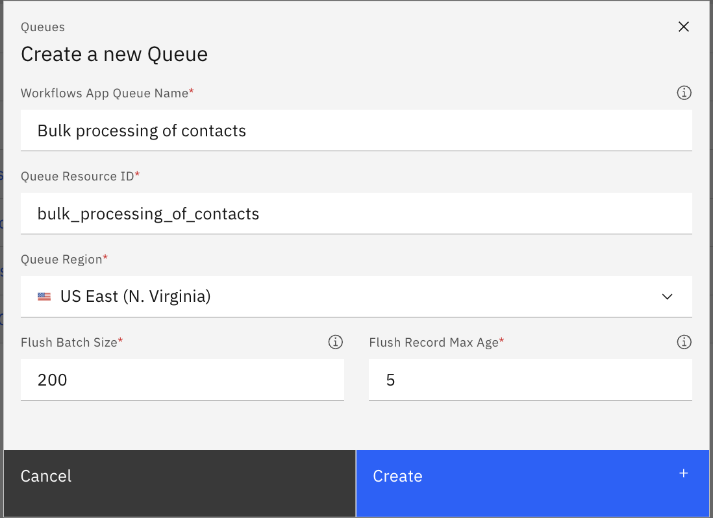
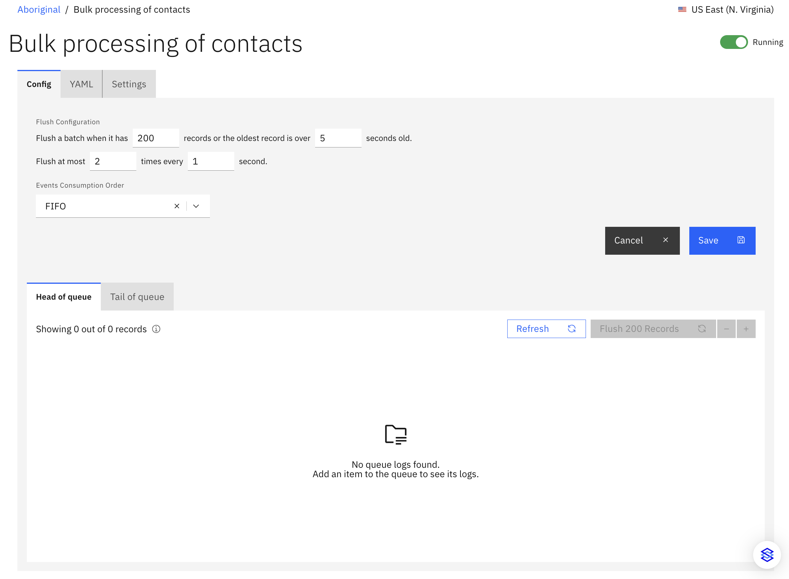
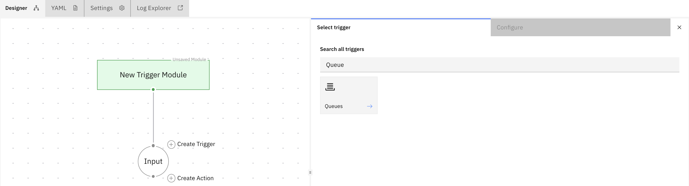
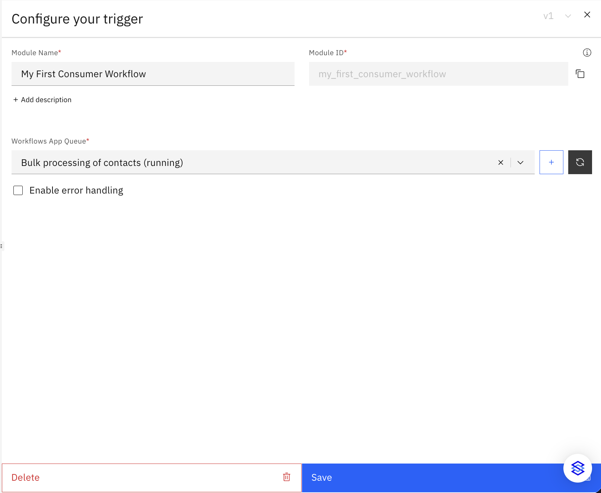

# Stacksync Queues

Queues act as the asynchronous backbone of Stacksync, allowing you to decouple data ingestion from data processing. By batching records and handling API rate limits natively, Queues ensure reliable, high-volume data delivery between sources (like PostgreSQL) and destinations (like HubSpot).

A Queue in Stacksync is a managed message broker designed to handle high-throughput event streams. It bridges the gap between real-time Sync operations and complex Workflows.

**Core Benefits:**

- **Asynchronous Processing:** Handle high-volume events without blocking source systems.
- **Intelligent Batching:** Group records together to optimize downstream API calls and respect destination rate limits.
- **Seamless Integration:** Effortlessly connect your real-time Sync operations with advanced [Workflow automations](https://docs.stacksync.com/workflow-automation).

---

## Creating a Queue

The creation of a Queue is initiated via a modal on your **All Resources** tab. Follow these steps to configure and deploy a new Queue resource.

**1. Open the Queue Creation Modal**

From your workbench, navigate to **Home** > **Create Resource (⌄)** and select **Queue**. This opens the configuration modal.



**2. Configure Queue Parameters**

In the modal that appears, enter specific values for the following fields. The values shown below represent common production configurations.

- **Workflows App Queue Name:** Provide a unique, human-readable name for your Queue. This is its display name within Stacksync (e.g., `Bulk processing of contacts`).
- **Queue Resource ID:** Enter a unique programmatic identifier. This ID is used when referencing the Queue in code, JSON payloads, and API calls.
- **Queue Region:** Select the nearest geographical region for optimal performance (e.g., `US East (N. Virginia)`).
- **Flush Batch Size:** Set the exact number of records the Queue should accumulate before flushing. This directly controls your bulk processing volume. _Note: Consider destination API batch limits when setting this value._
- **Flush Record Max Age:** Define the maximum time a single record can sit in the Queue before a flush is triggered, regardless of batch size. This prevents records from lingering during low-activity periods.

**3. Finalize Deployment**

Once all fields are populated, click **Create** to deploy the Queue resource to your workspace.

**4. Detailed Configuration and Queue Management**

After creation, the queue opens in a new tab. This page allows you to monitor its status (e.g., **Running**), manage its underlying code via the **YAML** tab, and fine-tune its behavior in the **Config** tab.



Key management features available on this page include:
- **Advanced Flush Configuration:** Further refine how your Queue empties. You can set rate limits (e.g., Flush at most 2 times every 1 second) and define the **Events Consumption Order** (e.g., FIFO - First-In, First-Out).
- **Queue Inspection:** Use the **Head of queue** and **Tail of queue** toggles to inspect the records currently sitting in the broker. The interface displays the exact number of pending records.
- **Manual Execution:** Use the **Flush Records** button to manually force the Queue to send its current batch to the consumer immediately.
- **Activity Logs:** View execution logs for individual items added to the Queue to aid in debugging and monitor throughput.

---

## Adding Data to a Queue (Producers)

You actuate a Queue by pushing data into it. In Stacksync, you achieve this through [Sync Event Triggers](https://docs.stacksync.com/two-way-sync/guides/event-triggers) or standard [Workflows](https://docs.stacksync.com/workflow-automation).

### Via Sync Event Triggers

You can configure a Sync to push data directly to a queue when a specific database event occurs (e.g., a row is created, updated, or deleted in PostgreSQL).

When setting up the Event Trigger, construct your JSON payload using Stacksync variables to capture the event context:

- `<<record>>`: Replaced with the complete JSON representation of the database record.
- `<<changes>>`: Replaced with the specific fields modified during an update.
- `<<change_type>>`: Replaced with the operation performed (`"create"`, `"update"`, or `"delete"`).

**Example Payload Configuration:**

```json
{
  "record": <<record>>,
  "changes": <<changes>>,
  "change_type": "<<change_type>>"
}
````

### Via Workflows

For custom data ingestion, you can configure an upstream Workflow to insert data into the Queue. Add a **Queue** action node to formulate a POST request that delivers bulk processing data directly into your designated Queue.

-----

## Consuming Data from a Queue (Consumers)

To process the batched data, you must build a Consumer Workflow. This Workflow acts as the subscriber, receiving data in chunks based on your `Flush Batch Size` and `Flush Record Max Age` settings.

**Consumer Workflow Architecture:**

1. **Set the Trigger:** Create a new [workflow](https://docs.stacksync.com/workflow-automation) and select the **Queue** trigger.

    

2. **Bind the Queue:** Attach the trigger to your newly created Queue.

    

3. **Configure Trigger Parameters:** In the configuration panel that appears, enter specific values for the following fields:

      - **Module Name:** Provide a unique, human-readable name for your Trigger (e.g., `My First Consumer Workflow`).
      - **Module ID:** An autogenerated unique programmatic identifier used when referencing the Trigger in the workflow, JSON payloads, and API calls.
      - **Workflows App Queue:** Select the previously created queue from the dropdown (e.g., `Bulk processing of contacts`), then click **Save**.

4.  **Map the Destination:** To process the payload from the queue, configure a subsequent action in your [workflow](https://docs.stacksync.com/workflow-automation#id-4.-configure-your-action) to handle the incoming batch.
